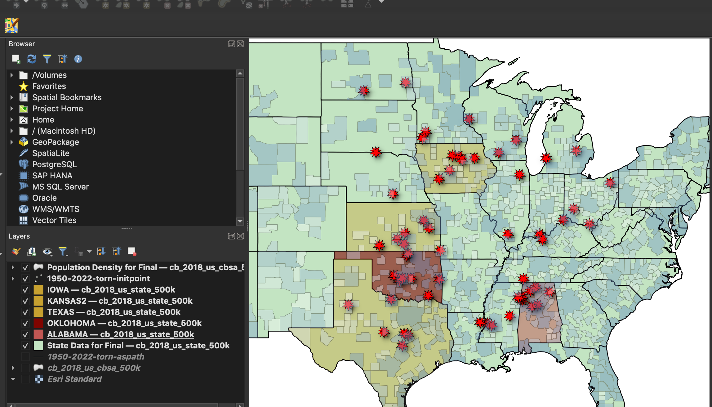

# Final-Project--Will-Webster-
Overview

The goal of this map is to visualize what states have the most intense tornadoes from 1950-2022. I wanted to show how the EF-5 tornados are frequent in the same areas over this period of time. I was in the Joplin tornado during 2011 so this subject has always been interesting to me. At first, I included data that showed every tornado that has happened since 1950. This has well over 10,000 results and made it nearly impossible to work with. So, I decided to only include the largest which are the EF-5s. I also created a population density to show how these tornadoes relate to populated areas of each state. 

Data Sources

There are three main data sources used in this project. Two of them have been used in this class for previous activities. 
cb_2022_us_cbsa_500k.zip (Shapefile)
cb_2022_us_state_500k.zip (Shapefile)
Source: https://www.census.gov/geographies/mapping-files/time-series/geo/cartographic-boundary.html
The other dataset used is the initial points of the tornadoes from 1950-2022. 
Source: https://www.spc.noaa.gov/gis/svrgis/zipped/1950-2022-torn-initpoint.zip 

Tools Used:

QGIS was used for representing the data, along with the geoprocessing tools and creating the statics map layouts.
Google Excel was used to visualize the number of EF-5 tornadoes in each state from 1950-2022.

Methodology:

Adding data-
As in most of the previous project this option to change the projection was determined when I opened QGIS. I kept it as the EPSG:3857. I feel that since I was covering a large area and not just one state there wasn’t a reason to change it from this. The first step that I did was load in the state data. Then I added the population data. I wanted to visualize the population density, so I used the field calculator to divide the population by an area. Next, I added in the tornado initial point data. This made almost the entire map on blob of color because of the vast number of points there were. I made it into a graduated symbology from the single symbol. Then I changed the classes to go from 1-2, 2-3, 3-4, and 4-5 based on the mag from the attribute table (EF level). This still did not look good on the map. I tried to change the classes based on the size from the method box. Still, it was too difficult to get an information from visualizing the map. Finally, I decided to just keep the 4-5 mag level. This only showed around 60 points which was much better. 

Joining fields-
After having all the data in QGIS it was time to start geoprocessing it to be able to visualize it better. The first thing I did was use the join layer property for the population density and the tornado points. Since the points went under the population density layer it was making it difficult to see the points in the heavy populated areas. After joining them I decided to drop the opacity level of the population density down to 40.0%. This allowed for a viewer to still see the population areas without focusing on it. The main point of focus is intended to be on the points of the tornadoes. 

Excel-
My main goal for making this map was to see where the largest tornadoes happen the most often at. To do this I had to go into the attribute table for the tornado layer, copy all the mag 5 level tornadoes and paste them into excel. Then I organized the excel document by state and counted how many tornadoes happened in each state from 1950-2022. After doing so I found that Oklahoma had the most of 8, Alabama the second most of 7, and a tie of third from Iowa, Kansas, and Texas. 

Color choice- 
The first field I changed the color of was the state level fields. Over this course of this class, I have found that making the underlining layer a shade of green was a good natural color. It doesn’t take away too much from the focus yet adds a stylish element as a background layer. After figuring out what states had the most amount of mag 5 tornadoes, I wanted to display this by a color change of those states. For each of these states I added in the state data and filtered to just that state. For the leading amount of Oklahoma, I changed the color to a dark red, and made the opacity 60%. For Alabama I made it a little color red with opacity of 50%. The next three I made a yellow color with the opacity of 50%.

